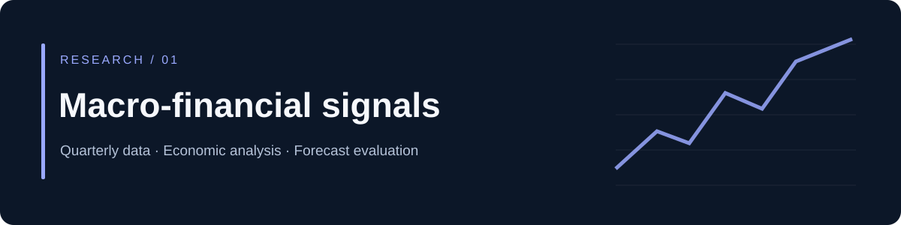
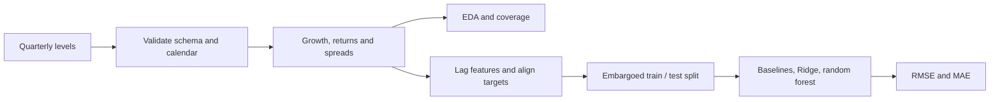

# Macro-financial signals and US GDP

**From quarterly data preparation to a transparent forecasting benchmark.**

[](https://github.com/AlbertoDc99/macro-financial-analysis/actions/workflows/tests.yml)


Do financial variables contain useful information about future economic growth? This project investigates equity returns, credit, money supply, interest rates, the term spread and volatility alongside US real GDP.

It began as a notebook-based research project covering data preparation, exploratory analysis, OLS, stationarity diagnostics, Granger tests, VAR and machine-learning comparisons. **This portfolio edition publishes a smaller, tested and reproducible core:** quarterly transformations, exploratory charts and temporal forecasting benchmarks. The broader original econometric experiments have not been revalidated for this edition.

## Start with the notebooks

| Notebook | Focus |
|---|---|
| [01 · Data and exploratory analysis](notebooks/01_data_and_eda.ipynb) | Schema validation, financial transformations, coverage and correlations |
| [02 · Forecast evaluation](notebooks/02_forecast_evaluation.ipynb) | One- and four-quarter targets, embargoed holdout, baselines, Ridge and random forest |

**The committed notebooks run on clearly labelled synthetic data.** Original provider datasets are not redistributed. A separate [research results note](reports/research-results.md) records aggregate metrics from a local rerun on the original US dataset, with its limitations.

## What to look for

- **Data engineering:** unique quarterly keys, a continuous calendar, numeric validation, explicit missing values and reusable transformations.
- **Analysis:** units and growth definitions are documented; the term spread always means 10-year minus 2-year yield.
- **Machine learning:** lagged features, training-label embargo, expanding temporal CV and scaling fitted inside each CV fold.
- **Research judgment:** simple baselines, adverse periods retained, no claim of real-time availability or structural causality.



## Reproduce the public demo

```bash
git clone https://github.com/AlbertoDc99/macro-financial-analysis.git
cd macro-financial-analysis
python -m venv .venv
# Activate .venv using your shell's usual command.
python -m pip install --upgrade pip setuptools
python -m pip install -r requirements-dev.txt
python -m pytest -q
python run_notebooks.py
```

The final command executes both notebooks with the current Python interpreter. No API keys or downloads of financial data are required. CI runs the tests and notebooks as well.

To analyze an independently obtained dataset with the same schema:

```python
import pandas as pd
from macro import evaluate

levels = pd.read_csv("data/quarterly_levels.csv")  # local, ignored by Git
scores, predictions, split_info = evaluate(levels, horizon=1, cutoff="2020Q1")
print(scores)
```

See [data sources and schema](docs/data-sources.md) and [methodology](docs/methodology.md) before interpreting results.

## Scope and limits

The public core starts from quarterly levels; it does not yet automate the original multi-provider ingestion. It does not reproduce the original VAR/IRF experiments. A four-quarter target means the quarterly growth rate **at t+4**, not cumulative growth over the next year.

Inputs in the historical study are revised observations, with no complete release-time calendar. A one-quarter feature lag is an explicit approximation. Results are retrospective research evidence, not an investable live forecast or a trading strategy.

Part of [Alberto Dueñas's data and finance portfolio](https://github.com/AlbertoDc99).
