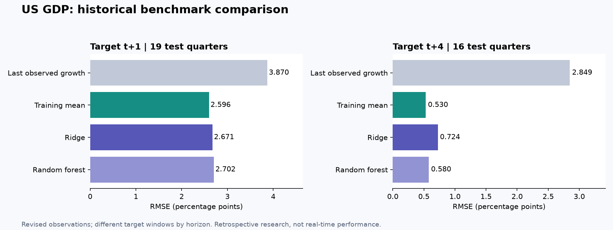

# Historical rerun: simple baselines remain competitive

Run date: September 9, 2026. This is a new evaluation of the portfolio core on the original local US quarterly dataset, not a reuse of scores from the exploratory notebooks.

**Neither fitted model beat the training-mean baseline on RMSE or MAE in this rerun.** The result argues for improving data timing and validation before adding model complexity. It does not establish that financial variables lack predictive information in general.

| Target horizon | Model | RMSE | MAE |
|---|---|---:|---:|
| t+1 quarter | Last observed growth | 3.870 | 2.161 |
| t+1 quarter | Training mean | **2.596** | **1.187** |
| t+1 quarter | Ridge | 2.671 | 1.211 |
| t+1 quarter | Random forest | 2.702 | 1.250 |
| t+4 quarters | Last observed growth | 2.849 | 1.672 |
| t+4 quarters | Training mean | **0.530** | **0.398** |
| t+4 quarters | Ridge | 0.724 | 0.515 |
| t+4 quarters | Random forest | 0.580 | 0.445 |

Errors are in percentage points of non-annualized quarterly GDP growth. The t+4 target is the quarter's growth at that horizon, not the following year's cumulative growth.

## Evaluation window

- h=1: 116 training observations, last training target 2019Q4; 19 test targets, 2020Q2–2024Q4.
- h=4: 113 training observations, last training target 2019Q4; 16 test targets, 2021Q1–2024Q4.
- Both use test origins starting at 2020Q1 and the same pre-2020 label cutoff.
- Ridge selected alpha 100 through training-only temporal CV at both horizons.

The horizons cover different target periods, so their raw errors should not be treated as a like-for-like difficulty comparison. The h=1 evaluation contains the sharp pandemic contraction and rebound; the h=4 evaluation starts later. The small test samples do not support a broad ranking of model families.

## Evidence and reproducibility

[Machine-readable aggregate results](aggregate-results.json) record split dates, counts, scores and the input file's SHA-256. The input is the original merged quarterly dataset, 1980Q1–2024Q4, using the source definitions in [data sources](../docs/data-sources.md). The hash identifies the file but does not make it available.

Original provider data are not redistributed. Exact reproduction of these historical metrics requires the same input snapshot, which is not included in the public repository. The synthetic notebooks and all tests are fully executable independently.

Revised GDP and other source observations, incomplete vintage metadata and approximate publication lags limit the study to retrospective analysis. These are not live forecast performance claims.
